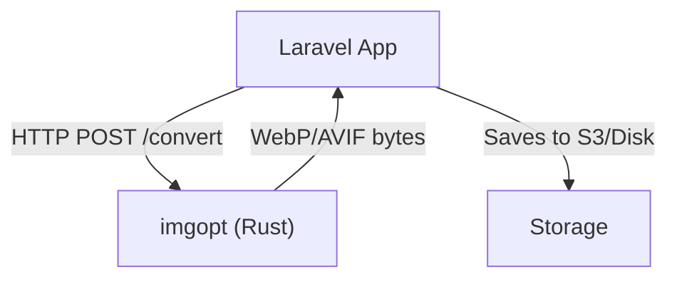

# imgopt - Image Optimization Microservice

`imgopt` is a high-performance microservice developed in **Rust** for the **Rush CMS** ecosystem. Its primary function is to receive images via HTTP, process them (resize, strip metadata), and convert them to **WebP** or **AVIF** efficiently.

## Why does this service exist?

Image processing in the main backend (Laravel) faced significant bottlenecks:
1. **Memory Consumption**: The PHP stack + Imagick/GD loaded the entire framework into memory for each conversion Job (~100MB+ per process)
2. **CPU Blocking**: Image encoding operations blocked Laravel workers, affecting other tasks
3. **System Dependencies**: Managing libraries like `libmagick` or `libgd` across different deployment environments was inconsistent

**`imgopt` Solution**:
- **Decoupling**: Removes the heavy load from the monolith.
- **Efficiency**: Drastically reduces RAM usage (from ~100MB to ~20-40MB under load).
- **Consistency**: Static binary or minimalist Docker image with all dependencies (such as `nasm`, `libwebp`).

## Why Rust?

Opting for Rust was strategic to ensure robustness and performance in a resource-constrained environment (shared VPS):

- **Memory Safety without GC**: Rust guarantees memory safety at compile-time without the unpredictable pauses of a Garbage Collector (unlike Go or Java), crucial for consistent latency in high-throughput services.
- **C/C++ Performance**: Utilizes top-tier native libraries (`rav1e` for AVIF, `libwebp` for WebP) with zero abstraction overhead
- **Safe Concurrency**: Rust's *ownership* model allows processing multiple images in parallel (via Tokio) without risk of *data races*
- **Modern Ecosystem**: Frameworks like **Axum** (based on Hyper and Tokio) offer market-leading ergonomics and performance for HTTP APIs

## Architecture

The service runs in a Docker container within the same internal network as Laravel (`coolify`), without public exposure.



- **Input**: Multipart form data (file + parameters)
- **Processing**: Decode -> Resize (optional) -> Strip Metadata -> Encode (WebP/AVIF)
- **Output**: Processed image bytes (stateless)

## Tech Stack

- **Language**: Rust 2021
- **Web Framework**: [Axum](https://github.com/tokio-rs/axum)
- **Async Runtime**: [Tokio](https://tokio.rs/)
- **Image Processing**:
    - `image` (decode/operations)
    - `webp` (libwebp bindings)
    - `ravif` + `rav1e` (high-efficiency AVIF encoding)
- **Memory Allocator**: `jemallocator` (optimized to avoid fragmentation on Linux)

## API Reference

### `POST /convert`

Converts an uploaded image.

**Headers**:
- `Authorization: Bearer <token>`
- `Content-Type: multipart/form-data`

**Body (Multipart)**:
- `file`: Image file (required)
- `format`: `webp` (default) or `avif`
- `quality`: 1-100 (default: 80)
- `width`: Target width (maintains aspect ratio)
- `height`: Target height
- `fit`: `cover`, `contain` (default: `cover`)

### `GET /health`

Returns service status.
```json
{ "status": "ok", "version": "0.1.0" }
```

## Development and Testing

### Prerequisites
- Rust (stable)
- `nasm` (required to compile the AV1 encoder `rav1e` with optimizations)

### Running Locally
```bash
# Configure environment variables
cp .env.example .env

# Run
cargo run
```

### Testing
The project includes unit and integration tests.
```bash
# Run all tests
# Note: --test-threads=1 is recommended if local memory is limited
export PATH=$PWD/bin_inst/bin:$PATH # If using local nasm
cargo test
```

### Production Build
The Dockerfile uses *multi-stage build* to create a lightweight final image (~debian-slim) containing only the compiled binary.

```bash
docker build -t imgopt .
```
